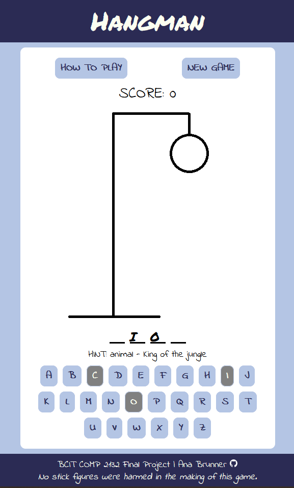

# Hangman

This classic game of "Hangman" was the final project for BCIT's "COMP 2132 - Web Development with JavaScript" course.

The goal of the project was to design the game using jQuery, SASS, and a public API.

[Live Website](https://anabrunner.github.io/hangman/)

